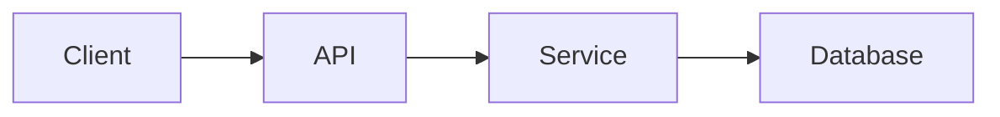

# Mermaid Diagram Guidelines

## Purpose

Mermaid diagrams are source-controlled architecture artifacts. They must clarify a decision, interaction, structure, lifecycle, or failure mode.

## Supported diagram types

Prefer:

- flowchart
- sequenceDiagram
- stateDiagram-v2
- classDiagram
- erDiagram
- journey
- timeline

## Example

## Rules

- Keep labels short.
- Avoid diagrams wider than a normal laptop screen.
- Split complex diagrams into multiple focused views.
- Use consistent names across diagrams and prose.
- Do not use color as the only carrier of meaning.
- Explain every diagram in the text.
- Avoid decorative diagrams.

## C4-style diagrams

Mermaid does not provide complete native C4 support in every renderer.

When using C4-style views, explicitly label the level:

- System context
- Container
- Component
- Deployment

Store reusable diagram sources under `diagrams/`.
