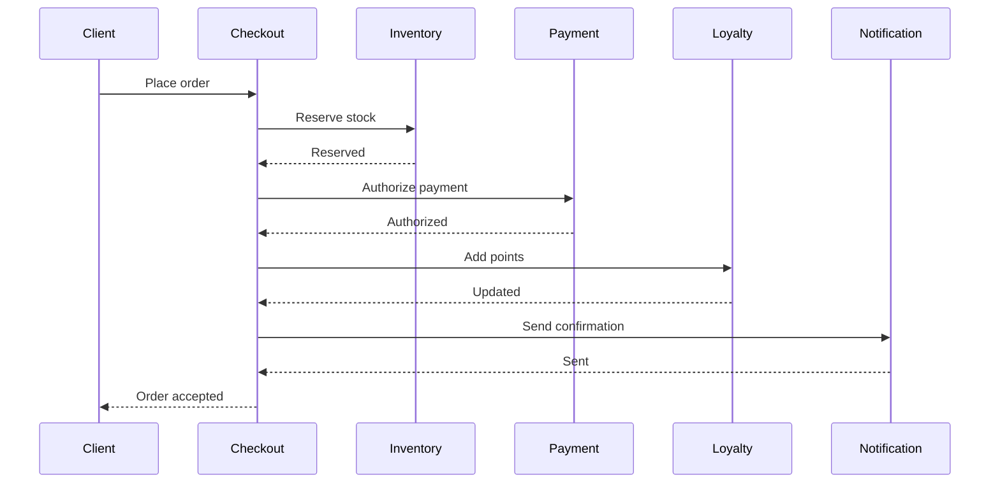
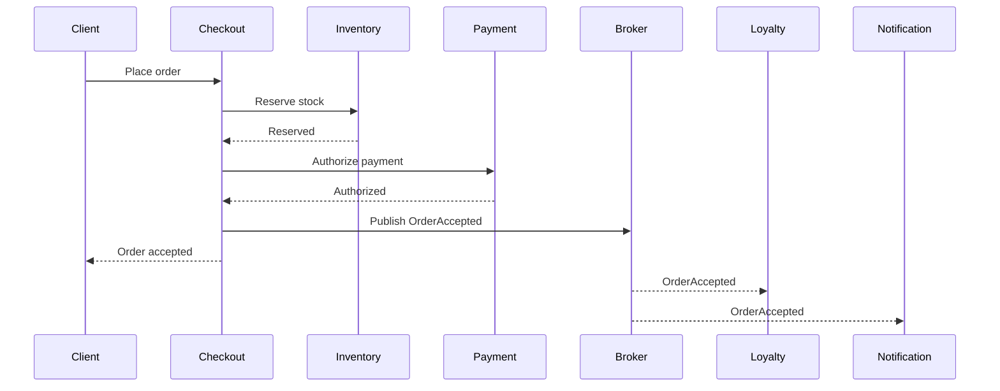

# Chapter 2 — Service Architecture

## Part 10 — Service Architecture Anti-Patterns: Hidden Coupling, Shared Logic, Chatty Systems and Other Architectural Traps

Service architecture fails less often because teams misunderstand services and more often because they adopt structures that look independent while remaining coupled in practice.

A system may have separate repositories, separate deployment pipelines, separate databases, and distinct service names, yet still behave like a single brittle application. The architecture diagram may show autonomy, but runtime behavior, release coordination, operational dependencies, shared code, and synchronized change reveal the truth.

Anti-patterns are not simply “bad practices.” They are recurring architectural responses that appear reasonable under local pressure but create systemic costs over time. Most begin as optimizations:

- shared libraries reduce duplication,
- synchronous calls simplify control flow,
- centralized orchestration improves visibility,
- shared DTOs accelerate integration,
- smaller services seem easier to understand,
- events appear to remove coupling,
- configuration reuse seems operationally efficient.

The problem is not the mechanism itself. The problem is using the mechanism in ways that weaken autonomy, hide dependencies, or distribute complexity without distributing responsibility.

This Part presents a practical catalog of service architecture anti-patterns and the signals that reveal them.

## Hidden coupling

Hidden coupling exists when two services can change, deploy, or operate independently only in theory.

Explicit coupling is visible. A synchronous API call, a shared database, or a declared event subscription can be documented and analyzed. Hidden coupling is more dangerous because teams often discover it only during deployment, incident response, or schema evolution.

Common forms include:

- assumptions about another service's internal data representation,
- undocumented call ordering,
- reliance on shared environment variables,
- copied validation rules,
- coordinated cache invalidation,
- identical release windows,
- shared operational runbooks,
- implicit expectations about response timing,
- dependencies on side effects that are not part of a contract.

For example, Memboux may define an Order Service and a Pricing Service. The Order Service formally calls the Pricing Service through a versioned API. The visible dependency appears acceptable. However, if Order assumes that discount calculations always complete in under 100 milliseconds, retries exactly twice, and returns a specific undocumented error shape when a promotion is invalid, the real contract is larger than the published API.

The architecture is coupled to behavior that no interface specification records.

Hidden coupling is often detected through questions such as:

- Can one team deploy without notifying another?
- Can the dependency change latency characteristics without breaking consumers?
- Can one service temporarily degrade without causing unrelated failures?
- Are operational assumptions documented as part of the contract?
- Do teams rely on tribal knowledge to coordinate changes?

A service boundary is trustworthy only when its hidden assumptions have been made explicit, reduced, or eliminated.

## Temporal coupling

Temporal coupling requires multiple components to be available or to act within the same time window.

Synchronous request-response communication naturally introduces temporal coupling. The caller and callee must both be operational at the moment of interaction. This is not always wrong. Many user-facing operations require immediate feedback. The anti-pattern appears when synchronous availability becomes the default even for work that does not require immediate completion.

Consider a Memboux checkout flow:



The client cannot receive confirmation unless every service responds successfully. Loyalty and notification have become part of the critical path even though neither is necessary to accept the order.

This creates a synchronous chain in which total reliability becomes the product of the reliability of all participants. Latency accumulates. Timeouts become difficult to tune. Retries may duplicate work. A minor downstream incident becomes a checkout outage.

Temporal coupling can be reduced by separating essential synchronous decisions from asynchronous consequences:



The goal is not to eliminate synchronous communication. It is to reserve it for interactions whose outcome must be known before the caller can proceed.

## Implementation leakage

Implementation leakage occurs when a service exposes internal design decisions through its contract.

Examples include:

- database column names in APIs,
- persistence entities serialized directly,
- internal workflow states exposed as public states,
- stack traces returned to consumers,
- storage identifiers used as business identifiers,
- internal enum values treated as stable external semantics,
- pagination based on physical table offsets,
- error codes tied to framework exceptions.

A service contract should express business meaning, not implementation convenience.

If Memboux's Customer Service exposes a field named `customer_row_version`, external consumers become coupled to the service's persistence mechanism. If the service later moves from a relational database to an event-sourced model, the field may no longer make sense. The service either carries obsolete semantics forever or breaks consumers.

Implementation leakage reduces evolvability because every internal refactoring becomes a potential integration change.

## Shared libraries

Shared libraries are useful for stable, technical capabilities such as logging adapters, tracing propagation, cryptographic primitives, and protocol clients. They become an anti-pattern when they contain business behavior shared across services.

A shared `memboux-business-rules` package may initially seem efficient. It prevents duplication and ensures consistent calculations. Over time, however, it creates several forms of coupling:

- all services depend on the same release cycle,
- one team's change affects many consumers,
- old and new rule versions coexist unpredictably,
- business ownership becomes unclear,
- service behavior changes through dependency upgrades rather than contract changes,
- testing responsibility is distributed.

A business rule should normally have one authoritative owner. Other services should use that rule through a contract, consume the result through an event, or deliberately maintain a local interpretation when autonomy is more important than exact central consistency.

Duplication is sometimes cheaper than shared coupling. Two small pieces of similar code owned independently may be safer than one shared library that coordinates five teams.

## Shared DTOs

Shared data transfer object packages are a specialized form of shared library coupling.

Teams often publish a package containing request, response, and event classes so producers and consumers compile against the same types. This improves development speed initially but weakens contract independence.

Problems include:

- producers and consumers must upgrade together,
- optional fields may become required accidentally,
- internal annotations leak across boundaries,
- consumers depend on fields they do not need,
- breaking changes appear as package changes rather than contract decisions,
- language and framework choices become coupled.

Contracts should be shared as specifications, not as implementation assemblies.

OpenAPI, AsyncAPI, JSON Schema, Protocol Buffers, or equivalent interface definitions may generate local types for each consumer. The important distinction is ownership: consumers own their generated or adapted models, while the provider owns the contract.

## Chatty APIs

A chatty API requires many small network calls to complete one business operation.

For example, a Memboux product page may call:

1. Product Service for the product,
2. Pricing Service for base price,
3. Promotion Service for discounts,
4. Inventory Service for stock,
5. Review Service for rating,
6. Shipping Service for delivery estimate,
7. Personalization Service for recommendations.

Some decomposition is natural, but a consumer making dozens of fine-grained calls is evidence that service boundaries or interface design may not match the business use case.

Chatty systems create:

- accumulated latency,
- increased failure probability,
- excessive serialization,
- connection pressure,
- complex retry behavior,
- hard-to-debug partial results,
- consumer knowledge of service topology.

Possible remedies include:

- coarse-grained use-case APIs,
- backend-for-frontend layers,
- read models,
- API composition,
- cached projections,
- event-driven materialized views.

The solution is not necessarily merging services. The solution is designing interfaces around consumer use cases rather than exposing internal entity operations.

## Synchronous chains

A synchronous chain is a request path that crosses many services before returning.

Each hop adds latency, availability dependency, timeout configuration, telemetry complexity, and potential retry amplification.

A chain such as:

```text
Gateway → Checkout → Order → Inventory → Warehouse → Supplier
```

may look modular, but the user request now depends on six independently failing components.

Common warning signs include:

- nested timeouts,
- repeated circuit breakers,
- global request identifiers used to reconstruct long call graphs,
- one service acting mainly as a pass-through,
- incidents where a low-level dependency disables a high-level capability,
- retries at multiple layers.

Architects should limit synchronous depth. When deep chains are unavoidable, they should be treated as explicit reliability structures with budgets for latency, timeout, retry, and failure handling.

## Premature microservices and nano-services

Premature microservices appear when teams distribute a system before the domain, ownership model, operational platform, or scaling needs justify distribution.

The result is often a large tax:

- network communication,
- deployment pipelines,
- service discovery,
- observability,
- distributed debugging,
- contract evolution,
- security between services,
- failure handling,
- data consistency.

A modular monolith may provide stronger boundaries at far lower operational cost while the domain is still evolving.

Nano-services take decomposition further by creating services around tiny technical functions or individual entities. Examples include:

- one service for email validation,
- one service for address formatting,
- one service for a single database table,
- one service per command,
- one service per CRUD resource.

Such services rarely own meaningful business capabilities. They create high coordination cost and low autonomy.

A service should be small enough to understand and own, but large enough to represent coherent responsibility.

## Over-engineering

Over-engineering occurs when architecture introduces mechanisms for scale, variability, or failure modes that do not exist.

Examples include:

- event sourcing for simple reference data,
- multi-region active-active deployment for an internal tool,
- a service mesh for a handful of services,
- custom orchestration engines for straightforward workflows,
- generalized plugin systems with no real extensions,
- multiple messaging technologies without distinct requirements.

Over-engineering increases cognitive load and operational burden. It also makes future change harder because teams must preserve infrastructure built for hypothetical scenarios.

Architecture should be sufficient, not maximal.

## Smart endpoints, dumb pipes—and its misuse

“Smart endpoints and dumb pipes” encourages business logic to reside in services rather than central integration infrastructure. The principle protects service autonomy and avoids recreating an enterprise service bus with hidden business behavior.

However, teams can misuse the slogan.

A pipe should be dumb regarding domain decisions, but it still requires robust technical behavior:

- delivery guarantees,
- authentication,
- authorization,
- observability,
- backpressure,
- retention,
- dead-letter handling,
- routing metadata.

Likewise, a smart endpoint should not become an oversized service that contains every workflow, transformation, and policy.

The useful distinction is not smart versus dumb in absolute terms. It is business intelligence versus transport responsibility.

## Orchestration abuse

Orchestration becomes abusive when a central component controls too much domain behavior.

A large orchestrator may know:

- every service,
- every sequence,
- every compensation,
- every error,
- every data transformation,
- every version difference.

It becomes a distributed monolith's central nervous system. Services become remote procedures rather than autonomous capabilities.

Orchestration is appropriate when one owner truly owns the end-to-end process and explicit coordination is required. It becomes harmful when the orchestrator absorbs decisions that belong inside participating domains.

## Event abuse

Events are often adopted as a universal solution to coupling. They can instead create invisible, asynchronous coupling.

Common forms of event abuse include:

- publishing events for every internal state mutation,
- treating commands as events,
- using events where immediate validation is required,
- creating long chains of undocumented reactions,
- placing entire database rows in event payloads,
- assuming consumers process events exactly once,
- using events to avoid defining ownership,
- allowing any service to react to any event without governance.

An event should represent a meaningful fact that has already happened.

Event-driven systems require explicit schemas, ownership, idempotency, ordering assumptions, retention policies, replay strategy, observability, and compatibility rules. Without these, events do not remove coupling; they hide it.

## Configuration coupling

Configuration coupling occurs when services depend on coordinated configuration values.

Examples include:

- matching timeout values across services,
- duplicated topic names,
- shared feature flags,
- synchronized environment variables,
- hard-coded service identifiers,
- identical routing tables,
- common configuration files deployed globally.

A change that requires editing several service configurations is an architectural change, even when no code changes.

Configuration should be owned, versioned, validated, and deployed with the component that depends on it whenever possible.

## Deployment coupling

Deployment coupling exists when services must be released together.

Signals include:

- release trains across teams,
- integration windows,
- mandatory version matrices,
- coordinated database migrations,
- consumers blocked until providers deploy,
- rollback requiring multiple services.

A service architecture with deployment coupling has failed one of the main tests of service autonomy.

Not every coordinated release is avoidable. Large business changes may legitimately span multiple services. The anti-pattern is routine coordination for ordinary change.

## Operational coupling

Operational coupling occurs when one service cannot be operated independently.

Examples include:

- shared dashboards with no service-level views,
- shared database connection pools,
- common scaling units,
- one alert for an entire platform,
- shared credentials,
- a single on-call team for unrelated domains,
- cascading restarts,
- maintenance procedures requiring system-wide shutdown.

Operational autonomy requires independent observability, scaling, recovery, ownership, and failure containment.

## Version explosion

Version explosion appears when teams respond to weak compatibility practices by creating many simultaneous API, event, and library versions.

The system accumulates:

- `/v1`, `/v2`, `/v3`, and `/v4` endpoints,
- multiple event schemas,
- parallel DTO packages,
- compatibility adapters,
- consumer-specific variants,
- indefinite support obligations.

Versioning is necessary, but unlimited version retention is not a strategy.

Teams should prefer additive change, tolerant readers, explicit deprecation, consumer migration tracking, and removal deadlines. A version should represent a meaningful compatibility boundary, not every schema adjustment.

## AI-specific service anti-patterns

AI systems introduce additional service traps.

### Model-as-a-service-everywhere

Every model or prompt becomes a separate service regardless of ownership, latency, or operational need. The result is a fragmented inference chain with high latency and unclear accountability.

### Prompt coupling

Consumers depend on exact prompt templates, hidden system instructions, model names, token limits, or response formatting. A model upgrade becomes a distributed breaking change.

### Shared vector-store ownership

Many services write to and query one vector database without clear domain ownership, indexing policy, retention model, or access boundaries. Retrieval quality becomes impossible to reason about.

### Agent chain explosion

A user request triggers multiple agents, tools, models, and retrieval steps synchronously. Reliability and cost degrade while failure attribution becomes opaque.

### Evaluation-free releases

Model or prompt changes are deployed as ordinary service changes without offline evaluation, regression sets, safety tests, or production quality signals.

### Non-determinism denial

The architecture assumes deterministic responses from probabilistic components. Retries, caching, auditing, and incident investigation then behave unpredictably.

In Memboux, an AI Product Description Service may initially expose a simple `generateDescription` endpoint. If downstream services assume a fixed JSON structure generated only through prompt wording, the contract is not real. The service must validate, constrain, and version its output independently of the model's raw response.

## Anti-pattern catalog

| Anti-pattern | Primary symptom | Hidden cost | Typical remedy |
|---|---|---|---|
| Hidden coupling | Undocumented coordination | Surprise breakage | Make assumptions explicit |
| Temporal coupling | Simultaneous availability required | Cascading outages | Move noncritical work async |
| Implementation leakage | Internal details in contracts | Refactoring resistance | Publish business semantics |
| Shared business library | Coordinated upgrades | Ownership ambiguity | Single authoritative owner |
| Shared DTO package | Lockstep consumers | Contract rigidity | Share specifications |
| Chatty API | Many fine-grained calls | Latency and fragility | Use-case-oriented interfaces |
| Synchronous chain | Deep request path | Multiplied failure risk | Limit depth and decouple |
| Premature microservices | High platform tax | Slow delivery | Start with modular boundaries |
| Nano-services | Tiny technical services | Coordination overhead | Merge around capabilities |
| Orchestration abuse | Central workflow brain | Distributed monolith | Return decisions to domains |
| Event abuse | Invisible reaction chains | Hidden async coupling | Govern meaningful events |
| Configuration coupling | Coordinated config edits | Release fragility | Local ownership and validation |
| Deployment coupling | Joint releases | Reduced autonomy | Backward-compatible evolution |
| Operational coupling | Shared recovery and scaling | Large blast radius | Independent operations |
| Version explosion | Many active versions | Permanent maintenance | Deprecation discipline |
| AI prompt coupling | Consumers depend on prompts | Model-change breakage | Stable validated service contract |

## Principle 083 — Service autonomy must be proven operationally

A service is not autonomous because it has a separate repository, process, or database. It is autonomous only when it can evolve, deploy, fail, scale, and recover without routine coordination with unrelated services.

### Rationale

Structural separation is easy to create. Behavioral and operational independence are harder. Hidden coupling converts apparent service architecture into a distributed monolith.

### Implications

- Evaluate autonomy through change and failure scenarios.
- Treat shared business logic as a coupling decision.
- Keep nonessential work out of synchronous paths.
- Design contracts around business meaning.
- Track deployment and operational dependencies.
- Govern event and AI interfaces as rigorously as synchronous APIs.

## ADR-0087 — Establish a service architecture anti-pattern review

### Status

Accepted

### Context

Memboux's service landscape is growing. Several teams have introduced shared DTO packages, synchronous service chains, cross-service configuration, and event-driven integrations. Each decision is locally understandable, but the combined effect risks creating hidden coupling and a distributed monolith.

### Decision

Memboux will introduce a service architecture anti-pattern review as part of architecture governance.

Every new or materially changed service interaction must be evaluated for:

- hidden and temporal coupling,
- contract leakage,
- shared business libraries,
- shared DTO ownership,
- synchronous call depth,
- chatty interaction patterns,
- deployment and operational coupling,
- event semantics and ownership,
- versioning strategy,
- AI-specific output and prompt coupling.

The review will not ban synchronous calls, orchestration, shared technical libraries, events, or service decomposition. It will require teams to state the trade-off and demonstrate why the chosen mechanism preserves acceptable autonomy.

### Alternatives considered

#### Rely only on team judgment

Rejected because coupling accumulates across team boundaries and is difficult for any single team to observe.

#### Ban specific technologies and patterns

Rejected because the same mechanism can be appropriate or harmful depending on context.

#### Centralize all integrations in a platform team

Rejected because it would create a new organizational and architectural bottleneck.

### Consequences

#### Positive

- Coupling becomes visible earlier.
- Service boundaries are evaluated through operational behavior.
- Teams gain a shared vocabulary for architectural risks.
- Versioning and event governance improve.
- AI service contracts become more explicit.

#### Negative

- Reviews add process overhead.
- Some teams must redesign convenient shared solutions.
- Existing coupling will require incremental remediation.
- Architectural judgment remains necessary.

### Revisit triggers

Revisit this decision if:

- reviews become bureaucratic without reducing incidents,
- service ownership changes materially,
- automated fitness functions can replace parts of the review,
- the platform introduces stronger compatibility and dependency analysis.

## Closing Reflection

Service architecture anti-patterns rarely announce themselves as mistakes.

They appear as reasonable shortcuts, consistency mechanisms, productivity improvements, or attempts to simplify distributed behavior. A shared package avoids duplicated code. A synchronous call provides certainty. An orchestrator makes a workflow visible. An event removes a direct dependency. A smaller service seems easier to own.

The danger appears when local convenience becomes systemic dependency.

The architect's task is therefore not to reject specific mechanisms. It is to reveal the coupling each mechanism introduces, identify who owns it, understand how it fails, and decide whether its cost is justified.

The most important question is not, “How many services do we have?”

It is, “How independently can they change and operate?”

That answer determines whether the architecture is truly service-oriented or merely distributed.

## Next

Chapter 2, Part 11 — Evolutionary Service Design: Growing Architectures Without Big Bang Rewrites
